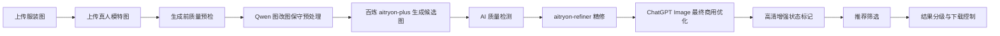

# AI虚拟人穿衣 SaaS v1.0.1 商用品质提升架构与开发说明

## 1. 版本目标

v1.0.1 不再追求功能扩展，核心目标是把“能生成试穿图”升级为“至少产出 1 张可商用图片”。系统成功标准从接口调用成功改为商用品质成功：

- 每个图片任务默认至少 4 张候选图。
- 每张候选图必须经过质量评分。
- 只有达到推荐门槛的图片才标记为“推荐”。
- 待修复、不可用结果不允许进入高清下载。
- 任务完成但没有推荐图时，前端必须明确提示“未达到商用推荐门槛”。

## 2. 核心链路



当前代码已完成的工程化能力：

- 后端 `/v1/system/capabilities` 输出供应商、试衣模型、精修模型、OSS 和商用门槛。
- 前端“商用品质生成前预检”展示阻断项和风险项。
- 前端支持填写 ChatGPT Image 最终优化要求，并自动复用 Agent 推荐参数作为输入源。
- 后端结果生成后写入 `quality_report`、`quality_status`、`issue_tags`、`hd_status`、`download_allowed`。
- 后端支持在试衣/精修结果后调用 OpenAI GPT Image 编辑接口做最终商用品质优化。
- 前端“结果管理”支持按推荐、可用、待修复、不可用筛选。
- 下载接口会阻断待修复和不可用结果。

## 3. 质量评分口径

综合分满分 100，当前 v1.0.1 先使用规则评分层承接真实质检模型，后续可替换为视觉质检模型。

| 维度 | 权重 | 当前字段 |
| --- | ---: | --- |
| 服装自然度 | 35% | `quality_report.garment_naturalness` |
| 服装一致性 | 30% | `quality_report.garment_consistency` |
| 清晰度 | 20% | `quality_report.clarity` |
| 人体自然度 | 10% | `quality_report.body_integrity` |
| 背景质量 | 5% | `quality_report.background_quality` |

推荐门槛：

- 综合分 `>= 80`。
- 服装自然度、服装一致性、清晰度均不得低于 `70`。

结果分级：

- `recommended`：可商用，允许高清下载。
- `usable`：轻微瑕疵，允许基础下载。
- `repair_needed`：待修复，不允许直接下载。
- `unusable`：不可用，不允许下载。

## 4. 模型链路策略

前端提供三种品质链路：

- 快速预览：低成本初筛，不承诺商用高清。
- 商用品质：默认链路，至少 4 候选图，开启质检、精修、高清门槛。
- 商拍增强：更严格推荐门槛，用于业务评审、电商详情页和广告图。

图改图模型继续支持三档：

- `qwen-image-edit-plus`：轻量保守编辑，成本较低。
- `qwen-image-2.0-pro`：纹理和语义更强，适合商用详情图。
- `qwen-image-edit-max`：复杂一致性更强，成本最高。

## 5. 关键接口

- `GET /v1/system/capabilities`：获取当前模型和商用品质能力边界。
- `POST /v1/tryon/tasks`：提交任务，写入品质链路参数。
- `GET /v1/tryon/tasks/{id}`：获取任务阶段、质量汇总、结果列表和失败详情。
- `GET /v1/tryon/results`：结果管理列表。
- `GET /v1/tryon/results/{id}/download`：下载结果，未达下载门槛会返回 409。

## 6. ChatGPT Image 最终优化

最终优化定位为后处理，不替代百炼试衣模型：

```text
百炼负责：把服装穿到真人模特身上。
ChatGPT Image 负责：在不换人、不换衣、不改商品信息的前提下，优化清晰度、纹理、边缘融合、曝光、白平衡和电商质感。
```

前端字段：

- `post_optimize.enabled`：是否开启最终优化。
- `post_optimize.model`：`gpt-image-1.5`、`gpt-image-1`、`gpt-image-1-mini`。
- `post_optimize.prompt`：用户/Agent 给出的详细优化要求。
- `post_optimize.size`：默认 `1024x1536`。
- `post_optimize.quality`：商用品质默认 `high`。

后端环境变量：

```bash
OPENAI_API_KEY=
OPENAI_IMAGE_EDIT_URL=https://api.openai.com/v1/images/edits
OPENAI_IMAGE_OPTIMIZER_ENABLED=true
OPENAI_IMAGE_OPTIMIZER_MODEL=gpt-image-1.5
OPENAI_IMAGE_OPTIMIZER_SIZE=1024x1536
OPENAI_IMAGE_OPTIMIZER_QUALITY=high
OPENAI_IMAGE_OPTIMIZER_OUTPUT_FORMAT=png
OPENAI_IMAGE_OPTIMIZER_INPUT_FIDELITY=high
```

如果国内网络无法直接访问 OpenAI，可使用 302.AI 的 OpenAI 兼容中转：

```bash
OPENAI_API_KEY=302.ai 的 API Key
OPENAI_IMAGE_EDIT_URL=https://api.302.ai/v1/images/edits
```

## 7. 后续必须增强

当前 v1.0.1 已把质量闭环骨架接入软件，但要真正达到服装电商商用图，还需要继续接入真实视觉算法：

- 接入清晰度/分辨率检测，读取真实图片尺寸、模糊度和压缩质量。
- 接入服装一致性检测，对比输入服装与输出服装的颜色、纹理、图案、版型。
- 接入人体结构检测，识别手部、腿部、肩颈、躯干穿帮。
- 接入真正的 2x/4x 超分模型，推荐图下载前必须生成长边 2048px 以上高清图。
- 建立固定测试集看板，按上衣、裙装、裤装、外套、复杂图案输出通过率。
