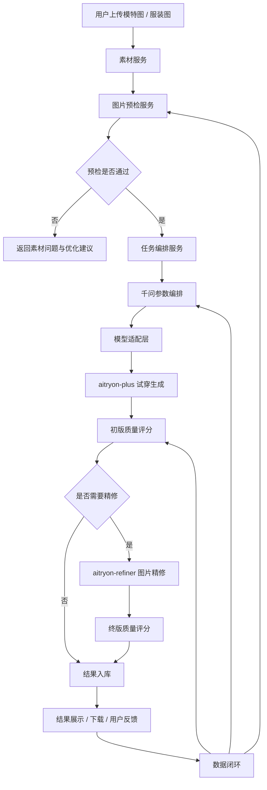

# 虚拟模特试穿 SaaS 模型与算法架构方案

版本：v1.0  
日期：2026-05-13  
负责人：多隆  
适用范围：虚拟模特试穿 SaaS 的模型选型、算法链路、任务编排、质量评估、成本控制与后续演进。

## 1. 文档目标

本文档用于定义虚拟模特试穿 SaaS 的模型与算法架构。当前系统以阿里云百炼 `aitryon-plus` 作为核心试穿生成模型，以 `aitryon-refiner` 作为图片精修模型，以千问大模型作为业务理解、参数编排、质检解释和智能运营能力的核心中枢。

本文档面向研发、算法、产品、测试和运维团队，目标是形成可执行、可拆解、可迭代的技术方案。

## 2. 业务目标

系统需要支持用户上传模特图与服装图，自动生成高真实感、高服装保真度、可商用的虚拟试穿图片。

核心目标：

- 稳定完成“模特图 + 服装图 → 试穿图 → 精修图”的生成闭环。
- 支持单图生成、批量生成、图库管理和结果下载。
- 在保证质量的前提下控制模型调用成本。
- 对输入素材、生成过程和输出结果进行自动质量评估。
- 通过数据闭环持续优化预检、参数推荐、质量评分和失败恢复策略。
- 为未来接入自研模型、备用模型和多模型路由预留架构空间。

## 3. 当前模型定位

### 3.1 aitryon-plus

`aitryon-plus` 是当前系统的核心试穿生成模型。

主要职责：

- 根据模特图和服装图生成虚拟试穿结果。
- 支持上装、下装、上下装组合、连衣裙和连体衣等场景。
- 在高质量模式下优先保证服装纹理、Logo、版型和图像清晰度。

输入：

- 模特图片 URL。
- 服装图片 URL。
- 服装类型。
- 人脸策略。
- 输出分辨率策略。
- 其他业务参数。

输出：

- 初版 AI 试穿图。

设计原则：

- 业务代码不直接调用 `aitryon-plus`，必须通过模型适配层调用。
- 所有模型请求、响应、耗时、成本和失败原因必须记录。
- 图片 URL 必须为公网可访问地址，并设置合理有效期。

### 3.2 aitryon-refiner

`aitryon-refiner` 是当前系统的图片后处理精修模型。

主要职责：

- 增强 `aitryon-plus` 输出图片的真实感。
- 提升清晰度、边缘融合、质感和商业可用性。
- 为高阶套餐和商拍场景提供成片能力。

输入：

- `aitryon-plus` 生成的试穿图 URL。

输出：

- 精修后的结果图。

设计原则：

- 不建议所有任务默认调用精修模型。
- 免费预览和快速筛选任务默认跳过精修。
- 高清成片、商拍成片、用户手动精修和智能评分触发场景进入精修。

### 3.3 千问大模型

千问大模型不承担图像像素级生成职责，而是作为智能业务中枢。

主要职责：

- 用户意图理解。
- 素材质量解释。
- 任务参数编排。
- 模型链路选择。
- 失败原因归类。
- 生成结果质检解释。
- 商品卖点、标题、详情页文案生成。
- 客服式引导和素材建议。

不建议承担：

- 图像生成。
- 严格计费。
- 权限控制。
- 底层人体检测。
- 底层服装分割。
- 像素级图像修复。

## 4. 总体模型架构



## 5. 核心服务模块

### 5.1 素材服务

职责：

- 接收用户上传图片。
- 存储原图、压缩图和缩略图。
- 生成模型可访问的临时 URL。
- 记录素材元数据。
- 支持素材删除、过期清理和权限校验。

核心字段：

```text
asset_id
workspace_id
user_id
asset_type
file_url
thumbnail_url
width
height
format
file_size
hash
metadata
created_at
status
```

关键要求：

- 所有图片必须进入对象存储。
- 模型调用时使用临时签名 URL 或安全 CDN URL。
- URL 有效期必须覆盖整个生成任务周期。
- 不同用户和工作区之间必须隔离访问权限。

### 5.2 图片预检服务

图片预检服务用于降低无效生成成本，是模型链路前置风控模块。

模特图预检项：

- 是否有人。
- 是否单人。
- 是否全身或半身。
- 是否正面。
- 身体是否完整。
- 脸部是否清晰。
- 姿态是否适合试穿。
- 是否遮挡严重。
- 是否多人或敏感内容。
- 分辨率、格式、大小是否合规。

服装图预检项：

- 是否为服装。
- 服装类型识别。
- 是否平铺图或真人穿着图。
- 背景是否干净。
- 是否有明显 Logo。
- 纹理是否复杂。
- 是否遮挡严重。
- 是否适合当前试穿模型。

预检输出示例：

```json
{
  "valid": true,
  "asset_type": "model_image",
  "pose_quality": 0.86,
  "face_quality": 0.91,
  "body_completeness": 0.88,
  "risk_level": "low",
  "suggestions": []
}
```

### 5.3 任务编排服务

任务编排服务负责把用户请求转换为可执行的模型任务。

职责：

- 创建试穿任务。
- 生成任务参数。
- 选择模型链路。
- 控制任务状态。
- 执行失败重试。
- 统计耗时和成本。
- 对接队列和 Worker。

任务状态：

```text
created
uploaded
prechecking
precheck_failed
queued
running_tryon
tryon_failed
tryon_succeeded
scoring
refining
refine_failed
refine_succeeded
completed
partially_completed
failed
cancelled
expired
```

### 5.4 模型适配层

模型适配层用于隔离业务代码与具体模型供应商。

统一接口：

```ts
interface TryOnProvider {
  createTask(input: TryOnInput): Promise<ModelJob>;
  getTaskResult(jobId: string): Promise<ModelResult>;
  cancelTask?(jobId: string): Promise<void>;
}
```

适配器：

```text
AliyunAitryonPlusProvider
AliyunAitryonRefinerProvider
FutureFluxProvider
FutureComfyUIProvider
FutureInternalModelProvider
```

设计价值：

- 后续可替换模型。
- 支持多模型路由。
- 支持灰度实验。
- 支持备用模型兜底。
- 支持统一监控、计费和错误归因。

## 6. 模型链路设计

### 6.1 标准高质量链路

适用于付费用户、商拍图、主图生成。

```text
素材上传
→ 图片预检
→ 千问参数编排
→ aitryon-plus
→ 初版质量评分
→ aitryon-refiner
→ 终版质量评分
→ 结果入库
→ 用户下载
```

### 6.2 快速预览链路

适用于免费用户、批量筛选和低成本预览。

```text
素材上传
→ 图片预检
→ aitryon-plus
→ 基础质量评分
→ 结果入库
```

快速预览链路默认不调用 `aitryon-refiner`。

### 6.3 智能精修链路

适用于成本敏感的生产环境。

```text
aitryon-plus 结果
→ 质量评分
→ 高分直接交付
→ 中分进入精修
→ 低分换参数重试
→ 极低分提示用户更换素材
```

建议阈值：

```text
score >= 85：直接交付
70 <= score < 85：进入 refiner
50 <= score < 70：换参数重试一次
score < 50：提示用户更换素材
```

### 6.4 批量生成链路

适用于商家批量 SKU 生产。

```text
N 个模特 × M 件服装
→ 生成任务矩阵
→ 按套餐和优先级排队
→ 并发限流执行
→ 失败任务自动处理
→ 结果聚合
→ 批量下载
```

批量任务要求：

- 支持任务上限。
- 支持断点续跑。
- 支持单任务失败不影响整批任务。
- 支持部分完成状态。
- 支持批量导出和结果筛选。

## 7. 质量评分体系

质量评分用于判断结果是否可交付、是否需要精修、是否需要重试。

总分为 100 分。

评分维度：

```text
服装一致性：25 分
人体结构合理性：20 分
人脸一致性：15 分
图像清晰度：15 分
边缘融合质量：10 分
背景自然度：5 分
手部、颈部、腰部异常：5 分
商业可用性：5 分
```

质量等级：

```text
S：90-100，可作为商拍主图
A：80-89，可商用，建议精修
B：70-79，可预览，需要人工挑选
C：50-69，不建议交付，可重试
D：低于 50，失败或素材不适合
```

质量报告示例：

```json
{
  "overall_score": 83,
  "garment_consistency": 22,
  "body_integrity": 17,
  "face_consistency": 14,
  "clarity": 12,
  "edge_quality": 8,
  "background_naturalness": 4,
  "artifact_penalty": -2,
  "commercial_grade": "B+",
  "decision": "send_to_refiner"
}
```

## 8. 千问微调方案

### 8.1 微调目标

千问微调目标是让大模型理解虚拟试穿业务，并输出稳定、结构化、可执行的决策。

主要能力：

- 判断素材是否适合生成。
- 推荐试穿类型。
- 推荐人脸策略。
- 推荐分辨率策略。
- 判断是否需要精修。
- 解释失败原因。
- 生成用户可理解的优化建议。
- 生成商品文案和运营内容。

### 8.2 训练数据类型

图片预检数据：

```text
输入：图片描述、检测信息、用户目标
输出：是否适合试穿、风险等级、优化建议
```

参数选择数据：

```text
输入：服装类型、模特图状态、用户套餐、生成用途
输出：模型参数、链路选择、是否精修
```

失败归因数据：

```text
输入：任务参数、模型错误、生成结果质量报告
输出：失败类型、是否重试、用户提示文案
```

运营文案数据：

```text
输入：服装信息、风格、生成结果
输出：商品标题、卖点、详情页文案
```

### 8.3 输出格式

千问输出必须结构化。

```json
{
  "task_decision": "accept",
  "tryon_type": "dress",
  "face_policy": "restore_original",
  "resolution": "original",
  "need_refiner": true,
  "risk_level": "low",
  "user_message": "图片质量良好，可以生成高质量试穿图。"
}
```

## 9. 成本控制策略

### 9.1 产品档位

快速预览：

```text
只调用 aitryon-plus。
适合低成本预览和批量初筛。
```

高清生成：

```text
调用 aitryon-plus。
根据质量评分决定是否调用 aitryon-refiner。
```

商拍精修：

```text
调用 aitryon-plus 和 aitryon-refiner。
执行更严格的质量评分。
必要时允许一次智能重试。
```

企业批量：

```text
支持更高队列优先级。
支持批量任务、Webhook、API 接入和成本报表。
```

### 9.2 精修触发条件

触发精修：

- 用户选择高清或商拍档位。
- 用户手动点击精修。
- 质量评分处于中高区间但清晰度不足。
- 服装纹理复杂。
- Logo 明显。
- 输出用途为主图或广告图。

不触发精修：

- 免费预览。
- 初版质量已经足够高。
- 初版结构错误严重。
- 输入素材质量不合格。
- 用户余额不足。

### 9.3 重试策略

```text
模型接口失败：最多重试 2 次
网络超时：最多重试 2 次
生成质量低：最多换参数重试 1 次
素材质量问题：不重试
余额不足：不重试
用户取消：不重试
```

## 10. 并发与队列设计

系统必须使用异步任务队列，不允许前端同步等待模型结果。

推荐流程：

```text
API 接收任务
→ 写入数据库
→ 投递消息队列
→ Worker 拉取任务
→ 调用模型
→ 轮询模型结果
→ 写入结果
→ 通知前端
```

队列优先级：

```text
enterprise_high
paid_high
paid_normal
free_preview
retry_low
```

限流维度：

- 全局模型并发。
- 单用户并发。
- 单租户并发。
- 单模型并发。
- 单 API Key 并发。
- Worker 动态扩缩容。

## 11. 数据闭环

每一次生成任务都应成为后续优化的样本。

需要记录：

```text
输入模特图
输入服装图
用户选择参数
模型版本
生成结果
精修结果
质量评分
用户是否下载
用户是否收藏
用户是否重试
用户是否删除
用户人工评分
失败原因
任务耗时
模型成本
```

数据用途：

- 优化预检策略。
- 优化千问参数编排。
- 训练质量评分模型。
- 建立失败样本库。
- 指导套餐定价。
- 判断是否引入新模型。
- 反向优化用户素材上传指引。

## 12. 数据库核心表

### 12.1 assets

```text
id
workspace_id
user_id
type
url
thumbnail_url
width
height
format
size
hash
metadata
created_at
```

### 12.2 tryon_tasks

```text
id
workspace_id
user_id
status
quality_mode
model_asset_id
garment_asset_ids
params
output_asset_id
refined_asset_id
quality_score
failure_code
cost
created_at
completed_at
```

### 12.3 model_calls

```text
id
task_id
provider
model_name
request_payload
response_payload
status
latency_ms
cost
created_at
```

### 12.4 quality_reports

```text
id
task_id
overall_score
scores
decision
issues
created_at
```

### 12.5 user_feedback

```text
id
task_id
rating
action
comment
created_at
```

## 13. API 草案

### 13.1 创建试穿任务

```http
POST /api/tryon/tasks
```

请求：

```json
{
  "model_asset_id": "asset_model_001",
  "garment_asset_ids": ["asset_top_001"],
  "garment_type": "top",
  "quality_mode": "commercial",
  "face_policy": "keep_original",
  "resolution": "original"
}
```

响应：

```json
{
  "task_id": "task_001",
  "status": "queued"
}
```

### 13.2 查询任务状态

```http
GET /api/tryon/tasks/{task_id}
```

响应：

```json
{
  "task_id": "task_001",
  "status": "refining",
  "progress": 80
}
```

### 13.3 获取生成结果

```http
GET /api/tryon/tasks/{task_id}/result
```

响应：

```json
{
  "original_result_url": "https://example.com/original.png",
  "refined_result_url": "https://example.com/refined.png",
  "quality_score": 88,
  "commercial_grade": "A"
}
```

## 14. 安全与合规

### 14.1 用户授权

用户必须确认：

- 拥有上传图片的使用权。
- 不上传未授权他人肖像。
- 不生成违法、色情、欺诈、仿冒或侵权内容。
- 接受平台对违规内容进行拦截、删除和封禁。

### 14.2 内容审核

上传阶段审核：

- 色情、暴力和违法内容。
- 未成年人敏感场景。
- 名人或公众人物滥用。
- 商标和品牌侵权风险。

生成后审核：

- 过度暴露。
- 身体异常。
- 人脸异常。
- 不当内容。
- 品牌侵权风险。

### 14.3 数据安全

- 原图和生成图私有存储。
- 临时 URL 设置有效期。
- 企业用户数据隔离。
- 支持素材删除。
- 支持任务过期清理。

## 15. 分阶段路线图

### Phase 1：生成闭环

目标：稳定完成试穿图生成。

交付：

- 素材上传。
- 基础预检。
- 任务队列。
- `aitryon-plus` 调用。
- `aitryon-refiner` 调用。
- 结果展示。
- 基础错误处理。
- 基础额度扣费。

### Phase 2：质量与成本优化

目标：减少废图，降低无效成本。

交付：

- 图片预检增强。
- 自动质量评分。
- 智能精修策略。
- 失败原因分类。
- 任务重试策略。
- 成本看板。

### Phase 3：批量生产能力

目标：支持商家批量生成。

交付：

- 模特库。
- 服装库。
- 批量任务。
- 批量下载。
- 任务优先级。
- 企业工作区。
- Webhook 回调。

### Phase 4：千问微调与智能运营

目标：让系统具备智能商拍助手能力。

交付：

- 千问参数编排。
- 素材建议。
- 商品文案生成。
- 智能客服。
- 失败诊断。
- 自动报告。

### Phase 5：多模型与自研能力

目标：降低供应商依赖，增强产品差异化。

交付：

- 多模型路由。
- 自研质量评分模型。
- 自研素材分类模型。
- 备用生成链路。
- 品牌专属模特一致性方案。

## 16. MVP 范围

MVP 必须包含：

- 用户上传模特图。
- 用户上传服装图。
- 图片基础校验。
- 调用 `aitryon-plus`。
- 调用 `aitryon-refiner`。
- 异步任务状态。
- 图片结果展示。
- 失败重试。
- 基础额度扣费。
- 管理后台查看任务。

MVP 暂缓：

- 千问深度微调。
- 自研质量模型。
- 大规模批量生成。
- 企业 API。
- 复杂素材库。
- 高级合规审核。
- 多模型路由。

## 17. 关键风险与应对

输入素材质量差：

```text
通过上传前预检、素材规范、示例图和自动建议降低失败率。
```

生成结果不稳定：

```text
通过质量评分、有条件重试、参数自动调整和失败样本沉淀持续优化。
```

成本失控：

```text
通过产品分档、智能精修、用户额度、队列限流和成本看板控制。
```

模型供应商限制：

```text
通过模型适配层、多模型路由接口和备用模型方案降低依赖。
```

肖像和版权合规：

```text
通过用户授权、内容审核、私有存储、企业隔离和违规封禁控制风险。
```

## 18. 最终架构建议

当前阶段建议采用以下模型架构：

```text
aitryon-plus：核心试穿生成
aitryon-refiner：高价值精修
千问大模型：任务理解、参数编排、质检解释和运营助手
质量评分系统：成本控制与结果筛选
任务队列：规模化生产
模型适配层：未来模型替换和多模型路由
```

短期不要过早自研完整试穿大模型。更优路线是先用百炼模型建立稳定产品闭环，再通过质量评分、数据闭环和千问微调形成业务壁垒，最后基于真实数据逐步建设自研评分模型、素材分类模型、风格模型和备用生成链路。
