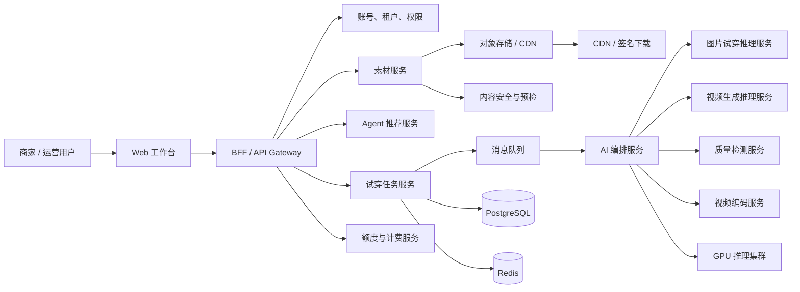
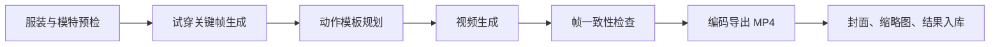
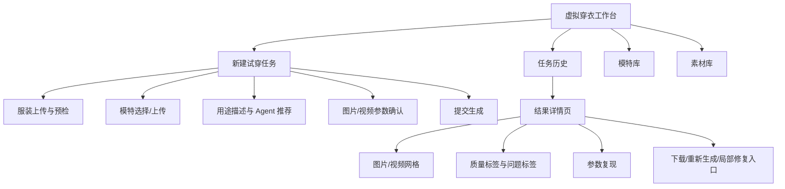
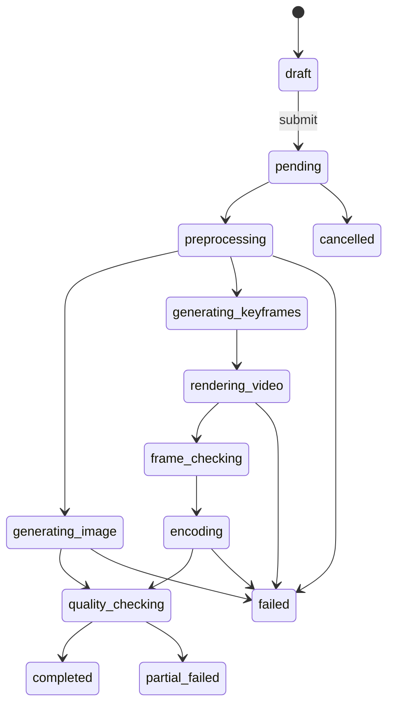
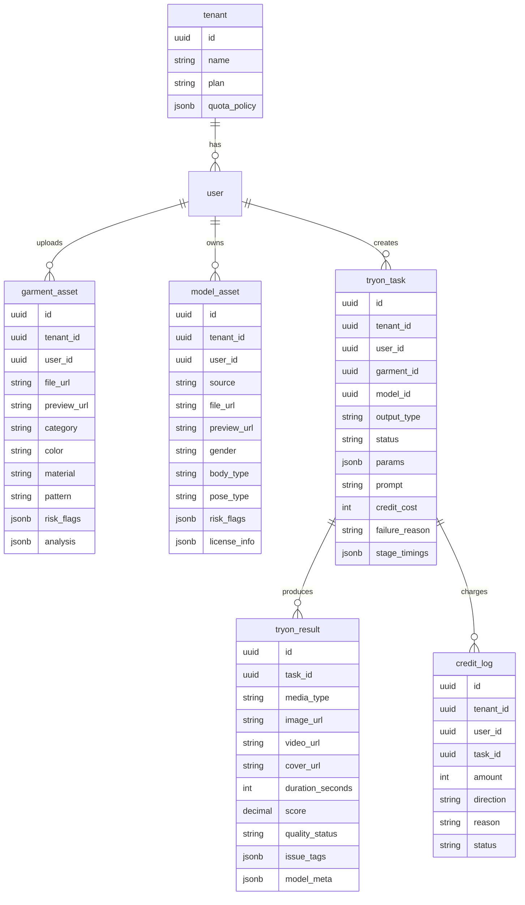

# AI 虚拟人穿衣 SaaS 核心功能架构与技术方案

版本：v1.0  
日期：2026-05-11  
依据：产品 PRD《AI虚拟人穿衣核心功能 PRD v1.0 图片与30秒视频》；Figma 原型链接已通过浏览器尝试打开，但当前停留在 Figma 登录页，Figma MCP 也因 Starter 计划调用上限无法读取节点，本文按 PRD 与原型页面结构诉求进行架构设计。

## 1. 架构目标

本期目标是交付“服装图 + 虚拟人/模特图 → 商用试穿图片 + 最长 30 秒试穿视频”的最小 SaaS 闭环。

核心验收目标：

- 图片任务：4 张图 P50 ≤ 90 秒，P90 ≤ 180 秒。
- 视频任务：15 秒 P50 ≤ 5 分钟，30 秒 P90 ≤ 12 分钟。
- 首次生成成功率 ≥ 80%，30 秒视频成功率 ≥ 70%。
- 支持上传预检、Agent 参数推荐、任务状态恢复、质量评分、下载、失败返还。
- 所有素材以签名 URL 访问，禁止跨用户读取。

## 2. 总体架构

架构原则：

- 前端只负责任务创建、状态展示、结果消费，不直接调用模型服务。
- 后端采用“同步创建任务 + 异步推理执行 + 状态轮询/推送”的任务架构。
- 图片和视频共用任务主表，但拆分不同执行管线，避免视频长任务拖慢图片链路。
- 预检、扣费、生成、质检、返还全部事件化，保证失败可恢复、可追踪。
- 模型能力通过 AI 编排层抽象，支持自研模型、第三方 API、混合路由逐步切换。

## 3. 核心业务流程

### 3.1 图片生成流程

1. 用户上传服装图。
2. 素材服务生成原图、压缩图、缩略图，写入对象存储。
3. 预检服务检查格式、大小、清晰度、主体完整性、敏感内容。
4. 服装识别服务输出品类、颜色、材质、图案、长度、风险标签。
5. 用户选择系统模特或上传模特图。
6. 模特预检服务输出人像、姿态、可穿衣区域、风险标签。
7. Agent 根据服装、模特、平台用途推荐画幅、背景、生成数量、风险提示。
8. 用户提交任务，计费服务预扣额度。
9. 任务服务写入 `pending` 状态并投递队列。
10. AI 编排服务执行预处理、试穿生成、质量检测、结果入库。
11. 前端通过轮询或 WebSocket/SSE 展示状态。
12. 用户下载推荐/可用结果；失败结果不可下载。

### 3.2 30 秒视频生成流程

视频链路不要简单复用图片链路，而应拆为关键帧、动作、帧一致性、编码四段：

建议 MVP 只开放 3 个视频模板：

- 静态镜头：成功率最高，适合白底商品详情页。
- 轻微转身：默认模板，兼顾效果与稳定性。
- 慢走展示：成本和失败率更高，需标记风险。

## 4. 服务拆分

| 服务 | 职责 | 关键能力 |
| --- | --- | --- |
| Web 工作台 | 新建任务、上传、参数、结果、历史 | React/Next.js、任务状态、媒体预览 |
| BFF / API Gateway | 聚合前端接口、鉴权、限流 | REST API、租户上下文、错误码统一 |
| Auth & Tenant | 用户、租户、套餐、权限 | RBAC、套餐限制、租户隔离 |
| Asset Service | 服装/模特/结果素材管理 | 上传、签名 URL、缩略图、元数据 |
| Moderation Service | 安全与质量预检 | 敏感内容、清晰度、主体完整性 |
| Agent Service | 参数推荐与结果解释 | 意图识别、平台推荐、风险提示 |
| TryOn Task Service | 任务生命周期核心服务 | 状态机、幂等、取消、重试 |
| AI Orchestrator | 推理流程编排 | 图片/视频 DAG、模型路由、回调 |
| Image Inference | 图片试穿模型服务 | 多图生成、纹理保持、画幅适配 |
| Video Inference | 视频生成模型服务 | 关键帧、动作模板、帧一致性 |
| Quality Service | 图片/视频质检评分 | 推荐/可用/待修复/失败、问题标签 |
| Billing Service | 额度预扣、结算、返还 | CreditLog、失败返还、套餐额度 |
| Notification Service | 完成提醒 | 站内通知、邮件可后置 |
| Admin Ops | 运营后台 | 失败阶段、耗时、成本、模型版本 |

MVP 可以先按“模块化单体 + 独立 AI Worker”落地，避免过早微服务化：

- 应用后端：Auth、Asset、Task、Billing、Agent API 合并在一个 NestJS/FastAPI 应用。
- AI 后台：Orchestrator、Image Worker、Video Worker、QC Worker 独立部署。
- 后续按压力拆分 Task、Billing、Asset。

## 5. 前端架构

### 5.1 页面结构

### 5.2 前端技术建议

- 框架：Next.js 15 + React 19 + TypeScript。
- UI：Tailwind CSS + shadcn/ui；图标使用 lucide-react。
- 状态：TanStack Query 管理服务端状态；Zustand 管理任务表单草稿。
- 表单：React Hook Form + Zod。
- 上传：分片/直传对象存储，前端先请求上传凭证。
- 任务状态：MVP 使用轮询；任务量上来后增加 SSE 或 WebSocket。
- 媒体预览：图片懒加载、视频封面优先、MP4 原生播放器。
- 错误体验：按预检、排队、推理、质检、编码、下载分别展示可理解错误。

### 5.3 关键前端组件

- `GarmentUploader`：上传、格式/大小提示、预检状态。
- `ModelSelector`：系统模特推荐、自定义模特上传、姿态风险。
- `AgentRecommendationPanel`：画幅、背景、姿势、视频模板推荐。
- `GenerationSettingsForm`：图片数量、画幅、背景、质量筛选、视频参数。
- `TaskProgressTimeline`：图片/视频不同状态流转。
- `ResultGallery`：图片与视频混合卡片、评分排序。
- `ResultDetailDrawer`：问题标签、输入参数、模型版本、复现信息。

## 6. 后端架构与接口

### 6.1 API 风格

推荐 REST + OpenAPI，任务状态可加 SSE：

- REST 适合素材、任务、下载、计费等资源型接口。
- SSE 适合单向推送任务状态，比 WebSocket 更轻。
- 内部服务事件使用消息队列，不通过前端接口串联。

### 6.2 核心接口

| 接口 | 方法 | 说明 |
| --- | --- | --- |
| `/v1/assets/upload-token` | POST | 获取服装/模特上传凭证 |
| `/v1/garments/analyze` | POST | 创建服装识别与预检任务 |
| `/v1/models/validate` | POST | 验证用户上传模特图 |
| `/v1/agent/recommendations` | POST | 根据素材与用途推荐参数 |
| `/v1/tryon/tasks` | POST | 创建图片/视频/组合任务 |
| `/v1/tryon/tasks/{id}` | GET | 查询任务详情 |
| `/v1/tryon/tasks/{id}/events` | GET | SSE 订阅任务状态 |
| `/v1/tryon/results/{id}/download` | GET | 获取签名下载 URL |
| `/v1/tryon/tasks/{id}/regenerate` | POST | 基于原参数重新生成 |
| `/v1/credits/balance` | GET | 查询额度余额 |
| `/v1/credits/logs` | GET | 查询扣费与返还记录 |

### 6.3 任务状态机

状态更新必须持久化，Worker 重启后可从最后成功阶段恢复或安全重试。

## 7. 数据设计

### 7.1 核心表

### 7.2 存储策略

- 原始上传：`tenant/{tenant_id}/uploads/{asset_id}/original`
- 预览缩略图：`tenant/{tenant_id}/previews/{asset_id}`
- 结果图片：`tenant/{tenant_id}/results/{task_id}/images`
- 结果视频：`tenant/{tenant_id}/results/{task_id}/videos`
- 下载统一走短期签名 URL，默认 10 到 30 分钟有效。
- 结果保留周期按套餐控制，例如免费/试用 7 天，付费 90 天，企业自定义。

## 8. AI 推理与模型路由

### 8.1 推荐链路

MVP 推荐采用混合路由：

- 服装/模特预检：优先自建轻量模型和规则，降低成本。
- 图片试穿：先接入成熟第三方或开源模型微调版本，保留自研替换接口。
- 视频生成：建议第三方 API + 自有质检兜底，先验证 30 秒稳定性。
- 质量评分：自研规则 + 视觉模型打分，形成可解释标签。

### 8.2 AI Orchestrator 设计

AI 编排服务负责把一次任务拆成可重试阶段：

- `asset_preprocess`
- `garment_analyze`
- `model_validate`
- `tryon_image_generate`
- `video_keyframe_generate`
- `video_motion_generate`
- `quality_check`
- `video_encode`
- `result_persist`
- `billing_settle`

每个阶段记录：

- 输入对象版本。
- 模型供应商与模型版本。
- 参数快照。
- 耗时、GPU 用量、失败码。
- 输出文件 URL 与校验信息。

### 8.3 GPU 调度

- 图片队列和视频队列分离：`tryon-image-high`, `tryon-image-default`, `tryon-video-default`。
- 视频任务设置更长超时与更低并发，避免挤占图片生成体验。
- 任务优先级按套餐、等待时间、任务类型综合排序。
- 失败重试限制：预处理失败不重试；第三方超时可重试 1 次；模型质量失败不盲重试。

## 9. 计费与额度

计费必须绑定任务状态，而不是绑定按钮点击本身：

1. 创建任务时检查余额。
2. 进入 `pending` 前预扣额度，写入 `CreditLog`。
3. 任务完成后按成功结果结算。
4. 系统错误、编码失败、部分失败按规则返还。
5. 用户素材违规或用户强制低质继续导致失败，不自动返还。

建议额度计算：

- 图片：按张扣费，质量筛选不单独扣费。
- 视频：按时长、比例、帧一致性模式扣费。
- 图片 + 视频组合：图片和视频分别预扣，分别结算。

## 10. 安全、合规与隔离

- 租户隔离：所有核心表带 `tenant_id`，后端强制从 token 注入租户上下文。
- 文件访问：对象存储私有桶 + 服务端签名 URL。
- 内容安全：上传前后都做敏感内容检测，违规素材不进入生成队列。
- 肖像授权：用户上传真人模特时增加授权确认字段，后续可扩展授权证明。
- 审计日志：记录上传、生成、下载、删除、退款/返还操作。
- 数据删除：支持用户删除素材与结果，后台异步删除对象存储文件。

## 11. 可观测性

必须记录的指标：

- 图片/视频任务成功率、失败率、部分失败率。
- 分阶段耗时：上传、预检、排队、推理、质检、编码、入库。
- GPU 利用率、队列等待时间、第三方 API 延迟。
- 质量标签分布：推荐、可用、待修复、失败。
- 扣费、返还、无效扣费投诉。
- 模型版本与失败码分布。

推荐技术：

- 日志：OpenTelemetry + Loki。
- 指标：Prometheus + Grafana。
- 链路追踪：Tempo / Jaeger。
- 错误监控：Sentry。
- 业务看板：Metabase / Superset。

## 12. 技术栈建议

### 12.1 MVP 推荐栈

| 层 | 推荐技术 | 原因 |
| --- | --- | --- |
| Web 前端 | Next.js + React + TypeScript | 快速构建 SaaS 控制台，生态成熟 |
| UI | Tailwind CSS + shadcn/ui + lucide-react | 适合快速实现高质量后台界面 |
| BFF/API | NestJS 或 FastAPI | NestJS 适合大型 TypeScript 团队；FastAPI 适合 AI 团队协作 |
| 数据库 | PostgreSQL | 任务、计费、租户、结果元数据强一致 |
| 缓存 | Redis | 任务进度、限流、短期状态缓存 |
| 队列 | Temporal / Celery / BullMQ | Temporal 最适合复杂可恢复工作流；MVP 可 BullMQ/Celery |
| 对象存储 | S3 / 阿里 OSS / 腾讯 COS | 图片视频私有存储与签名下载 |
| CDN | CloudFront / 阿里 CDN / 腾讯 CDN | 结果预览与下载加速 |
| AI 服务 | Python + FastAPI + PyTorch | 模型工程主流栈 |
| 视频处理 | FFmpeg | 编码、封面、转码、完整性检测 |
| 容器 | Docker + Kubernetes | GPU Worker 弹性调度 |
| IaC | Terraform | 云资源可复现 |
| 监控 | OpenTelemetry + Prometheus + Grafana + Sentry | 技术与业务可观测 |

### 12.2 国内部署选型

- 云：阿里云或腾讯云。
- 对象存储：阿里 OSS / 腾讯 COS。
- CDN：同云厂商 CDN。
- 数据库：RDS PostgreSQL。
- Redis：云 Redis。
- GPU：ACK/TKE GPU 节点池，或独立 GPU 推理服务。
- 内容安全：阿里云内容安全 / 腾讯云天御，叠加自研规则。

### 12.3 海外部署选型

- 云：AWS / GCP。
- 对象存储：S3 / GCS。
- CDN：CloudFront / Cloud CDN。
- GPU：EKS/GKE + GPU Node Pool，或 Replicate/RunPod/Modal 作为过渡。
- 内容安全：AWS Rekognition + 自研模型。

## 13. 研发里程碑

| 阶段 | 周期 | 研发重点 | 架构交付 |
| --- | --- | --- | --- |
| M1 原型联调 | 1 周 | 页面框架、上传、模特选择、假任务 | 前端工作台、Mock API、状态机草稿 |
| M2 图片链路 | 2 周 | 预检、图片生成、状态轮询 | Asset、Task、Image Worker、QC |
| M3 视频链路 | 2 周 | 视频模板、关键帧、MP4 导出 | Video Worker、编码、视频质检 |
| M4 结果与计费 | 1 周 | 下载、评分、预扣返还 | Billing、CreditLog、签名 URL |
| M5 灰度验证 | 1 周 | 真实 SKU 测试、监控、失败兜底 | 看板、告警、模型版本追踪 |

## 14. 关键风险与建议

| 风险 | 影响 | 建议 |
| --- | --- | --- |
| 30 秒视频纹理漂移 | 商用可用性下降 | 默认开启标准一致性检查，复杂模板标风险 |
| 第三方模型质量不稳定 | 成功率不可控 | 模型路由抽象，保留多供应商与自研替换 |
| GPU 成本失控 | 毛利受压 | 预检拦截、队列优先级、视频并发限制 |
| 违规/肖像授权问题 | 法务风险 | 上传检测、授权确认、审计日志 |
| 长任务状态丢失 | 用户体验差 | 状态机持久化、阶段幂等、Worker 可恢复 |
| 质量评分不可解释 | 用户不信任结果 | 评分 + 问题标签 + Agent 解释 |

## 15. 架构结论

建议第一版采用“Next.js 工作台 + 模块化后端 + 异步任务编排 + Python AI Worker + 私有对象存储”的架构。这样既能在 7 周内完成 PRD 的 P0 闭环，又不会把系统锁死在某个模型供应商或单一推理方案上。

最关键的工程抓手不是页面本身，而是三件事：

1. 可恢复的任务状态机。
2. 图片/视频分离的 AI 编排与队列。
3. 从第一天开始记录模型版本、失败阶段、质量标签和扣费流水。

只要这三件事设计扎实，后续扩展局部修复、批量生成、团队协作、开放 API、平台导出都会比较顺畅。
